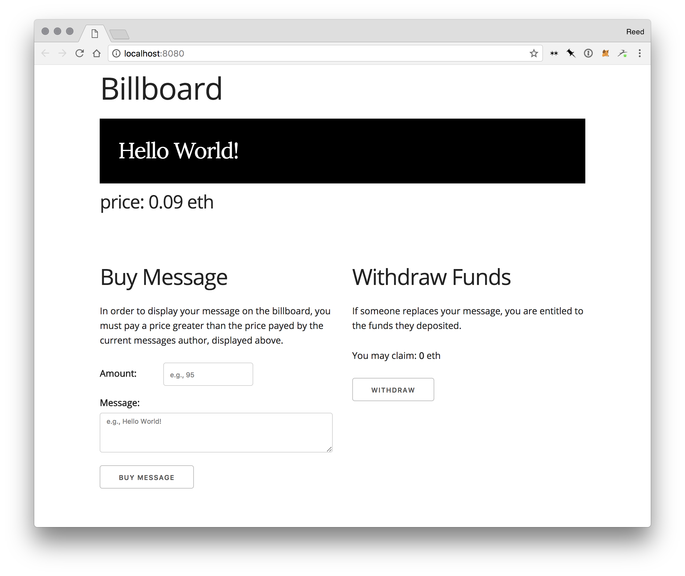

# Billboard

A website that displays a message that can be changed by anyone who is willing to pay a price greater than the current price. The price starts with 0 and increases with each message. A user whose message is replaced is entitled to the new message authors deposited funds.

The financial workings of this app are coded in an ethereum smart contract.



## Install

```
$ git clone
```

## Usage

```
$ truffle compile
$ truffle migrate --reset
$ npm run dev
```